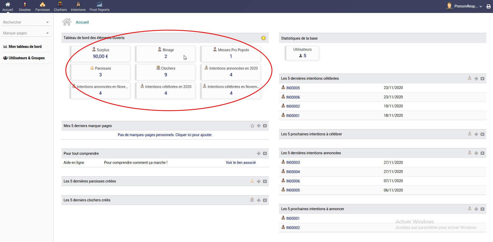
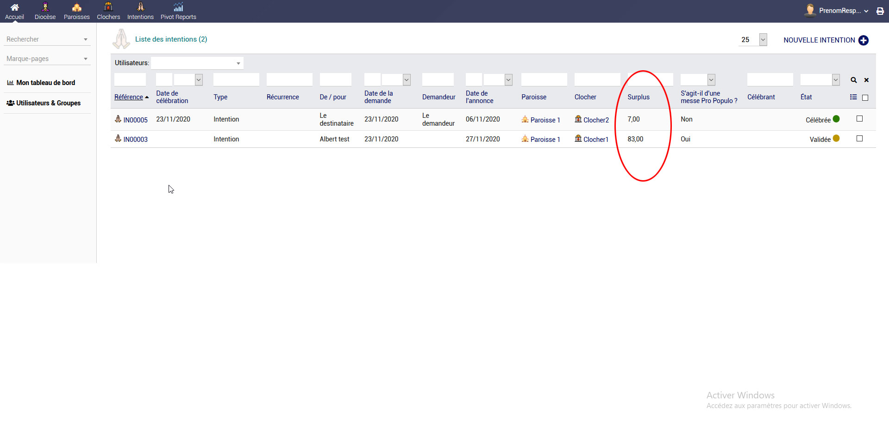

# Compteurs

## Qui peut utiliser les compteurs ?
* Tous les types de compte peuvent utiliser les compteurs
* Selon le type de compteur vous aurez soit :
* → Les informations relatives à votre compte utilisateur
* → Les informations relatives à votre paroisse
* → Les informations relatives à tout le diocèse

## Comment accéder aux compteurs ?
* Depuis le tableau de bord, lorsque vous arrivez sur deoriom, vous pouvez visualier tout de suite les principaux compteurs

## Utiliser les compteurs ?
* Lorsque vous cliquez sur le chiffre du compteur, vous être automatiquement redirrigé vers une page filtrée qui met en avant le détail de l'information.
* **Par exemple** Si vous cliquez sur le compteur de surplus, vous accéderez au détail du comptage de surplus

## Et si je veux d'autres chiffres qui ne seraient pas présents ?
* Dans ce cas, vous devez utilisez [l'outil de statistiques croisées dynamiques (pivot report)](pivotsreport)
