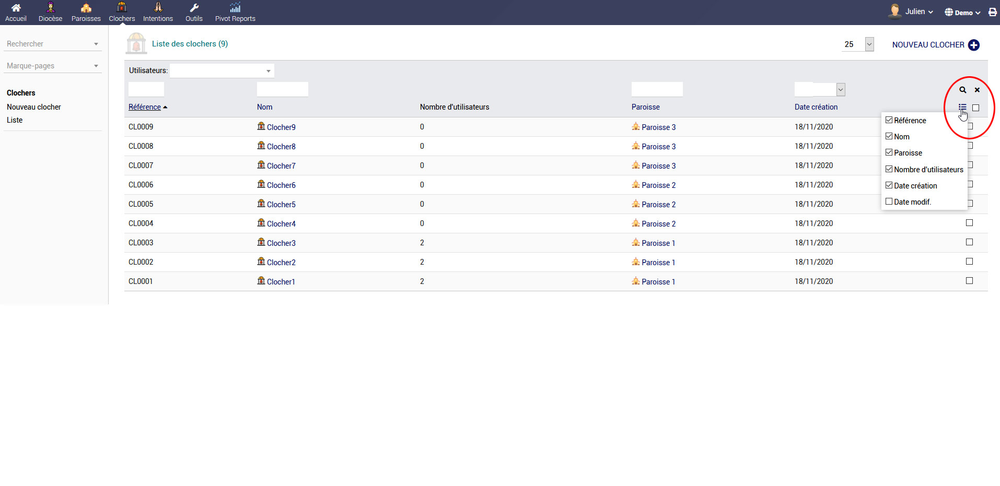
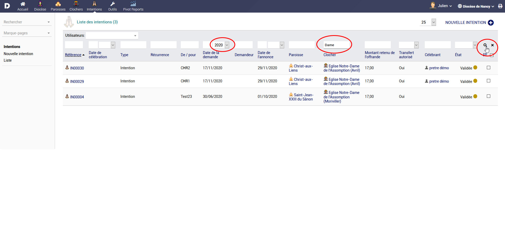
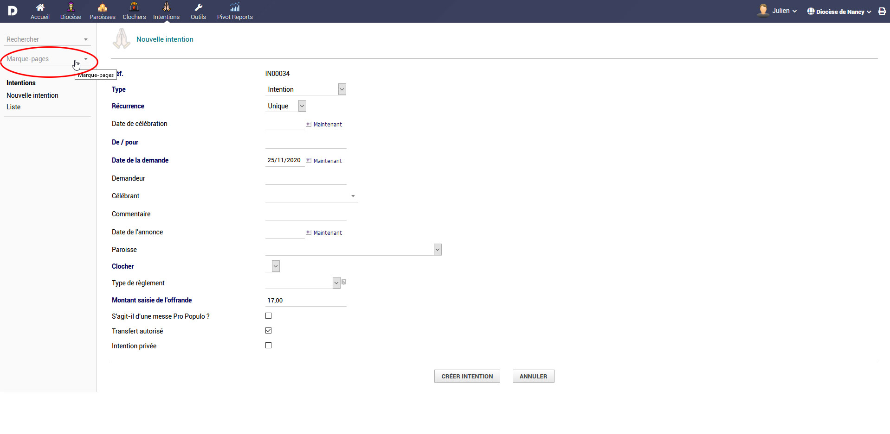
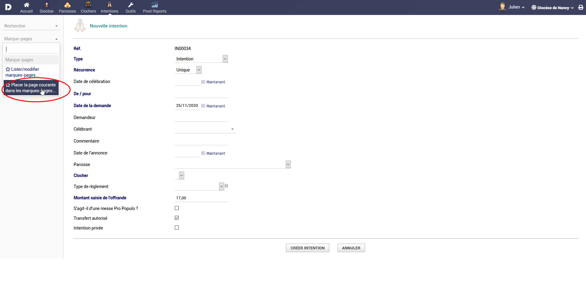
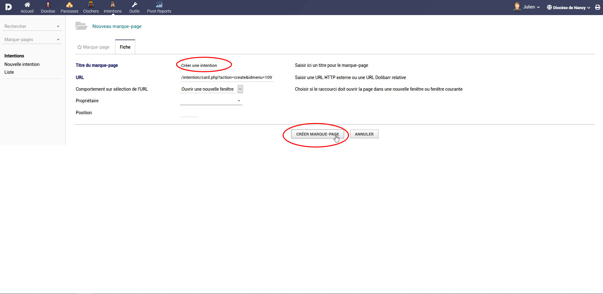

 # Considérations générales

## Comment utiliser cette documentation
* Cette documentation est là pour vous aider.
* Prenez le temps de la lire et de la comprendre
* Pensez à vous y référer
* Vous pouvez chercher une information dans cette documentation en utilisant le moteur de recherche situé en haut à gauche de l'écran
* La rubrique consulté affiche une table des matières en haut à droite de votre écran, qui vous permet de cibler directement le paragraphe que vous souhaitez consulter

## Informations à garder en tête !
* Dans deoriom, **seuls les champs en gras sont obligatoires** à remplir
* Les liens textes renvoient vers l'élément concerné
* Un clic sur une icone (par exemple, sur une icone pdf), affiche le fichier concerné.
* Deoriom est accessible à partir de n'importe quelle connexion internet et smartphone
* Votre mot de passe est personnel, ne communiquez pas votre accès à d'autres personnes.

## Personnaliser les listes
* Dans deoriom, vous pouvez facilement personnaliser les colonnes des listes d'affichage
* Pour cela, il vous suffit de cliquer sur l'icône située en haut à droite des listes et de sélectionner les colonnes que vous souhaitez voir ou masquer
* Cette affichage est propre à chaque utilisateur et peut être différent pour chaque liste

## Filtrer les données
* Dans les listes de données, vous pouvez facilement filtrer les informations depuis les en têtes des colonnes
* Il est possible d'utiliser plusieurs choix sur plusieurs colonnes différentes
* A tout moment vous pouvez annuler cette filtration en cliquant sur la croix en haut à droite

> [!TIP]
> Remarquez dans l'exemple l'utilisation de plusieurs filtres qui permet d'arriver facilement à la donnée désirée

## Utiliser les marques pages
* Les marques pages sont une fonction qui vous permettent de revenir rapidement à un écran de l'outil
* Pour ce faire, une fois que vous êtes sur la page désirée, par exemple, la création d'une nouvelle intention, cliquer sur le lien "Placer la page courante dans les marques pages"
* Renseigner à l'étape suivante un titre de marque page pour le retrouver facilement et valider.
* Votre raccourci est désormais disponible dans le menu des marques pages

