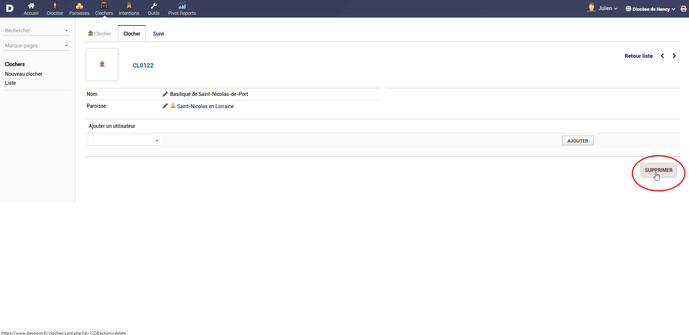

# Paroisses et Clochers

## Paroisse
* Les paroisses regroupent un ensemble de clochers
* Il est possible d'ajouter / modifier / supprimer autant de paroisses que nécessaires au sein d'un même diocèse
* Dans le cas de création en nombre sur les paroisses, prenez attache avec le support technique qui pourra vous accompagner.
* Des célébrants sont rattachés à une paroisse et peuvent ainsi interagir avec les éléments de la paroisse

## Clocher
* Un clocher représente un lieu de culte, qu'il s'agisse d'une église, d'une chappelle ou d'un autre lieu de culte consacré
* Le clocher est rattaché à une paroisse
* Des célébrants sont rattachés à une paroisse et peuvent ainsi interagir avec les éléments de la paroisse

## Voir la liste des paroisses
* Depuis le menu horizontal gauche, sélectionner [**Paroisses**](https://www.deoriom.fr/paroisse/index.php?idmenu=10906&mainmenu=paroisse)
* Là, depuis le menu gauche, sélectionner [**Liste**](https://www.deoriom.fr/paroisse/list.php?idmenu=10909&mainmenu=paroisse&leftmenu=)
* Vous obtenez la liste des paroisses
* Vous pouvez [filtrez les données](considerations_generales?id=filtrer-les-données) pour obtenir une liste de données plus précise

## Voir le détail d'une paroisse et la liste de ses clochers
* Cliquer sur le nom d'une paroisse pour obtenir la liste des clochers qui lui sont rattachés

## Modifier le nom d'une paroisse
* Selon vos droits, vous pouvez modifier le nom de la paroisse en cliquant sur l'icone de modification

## Ajouter un clocher à une paroisse
* Depuis le détail d'une paroisse, après la liste des clochers de la paroisse, utiliser le menu déroulant pour ajouter un clocher

> [!WARNING]
>**Attention** il est nécesaire que le clocher soit existant dans deoriom

## Supprimer un clocher d'une paroisse
* Selon vos droits, vous pouvez supprimer un clocher de la paroisse. Cela n'efface pas le clocher en tant que tel mais supprime le lien d'attachement entre la paroisse et le clocher

## Ajouter un utilisateur à la paroisse
* Ajouter un utilisateur à la paroisse, permettra à ce célébrant de célébrer des intentions pour cette paroisse
* Il n'y a pas de nombre limite de célébrant par paroisse
* Pour ajouter un célébrant à une paroisse, depuis le détail de la paroisse, aller en bas de l'écran, après la liste des clochers
* Choisissez un compte utilisateur et ajouter le en validant le bouton

> [!WARNING]
>**Attention** il est nécessaire que le compte utilisateur existe au par avant dans deoriom

## Ajouter un utilisateur au clocher
* Ajouter un utilisateur au clocher, permettra à un célébrant de célébrer des intentions pour ce clocher
* Il n'y a pas de nombre limite de célébrant par clocher
* Pour ajouter un célébrant à un clocher, depuis le détail du clocher, aller en bas de l'écran
* Choisissez un compte utilisateur et ajouter le en validant le bouton

> [!WARNING]
>**Attention** il est nécessaire que le compte utilisateur existe au par avant dans deoriom

## Supprimer définitivement un clocher
* Depuis le détail d'un clocher, cliquer sur le bouton supprimer
> [!WARNING]
>**Attention** Dans ce cas le clocher est supprimé totalement et définitivement de la deoriom

