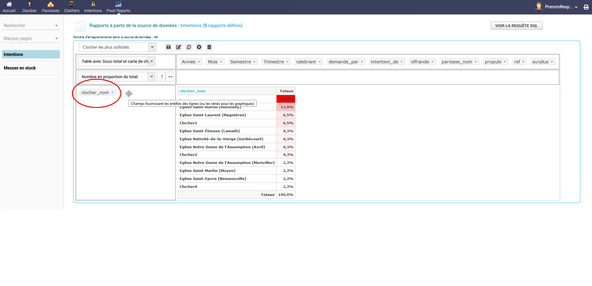
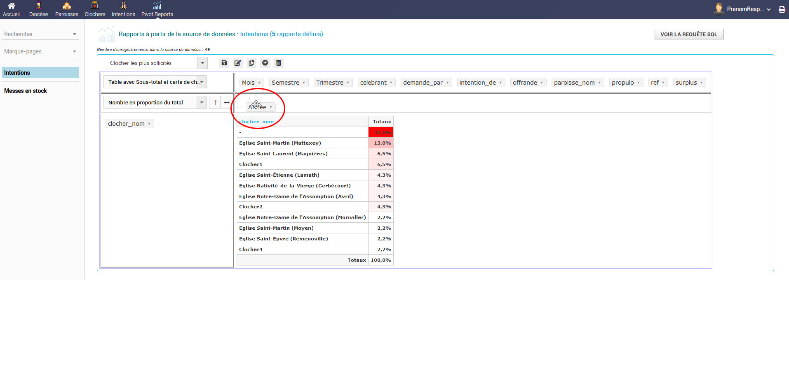
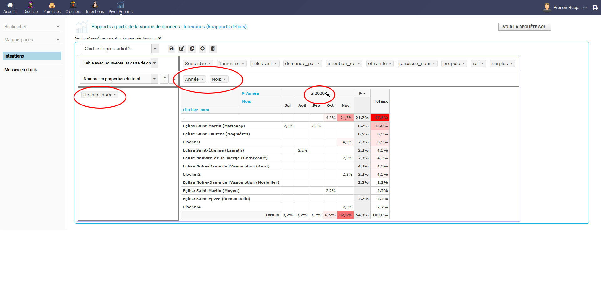
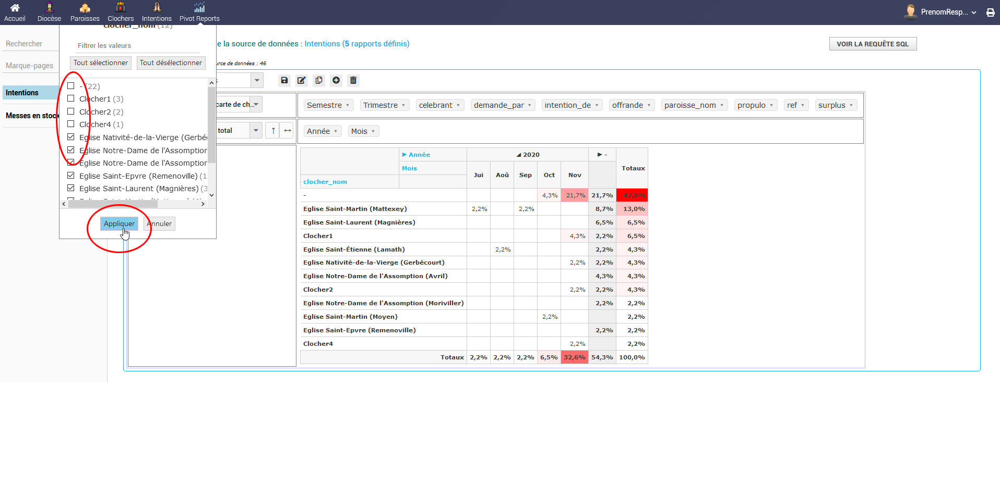
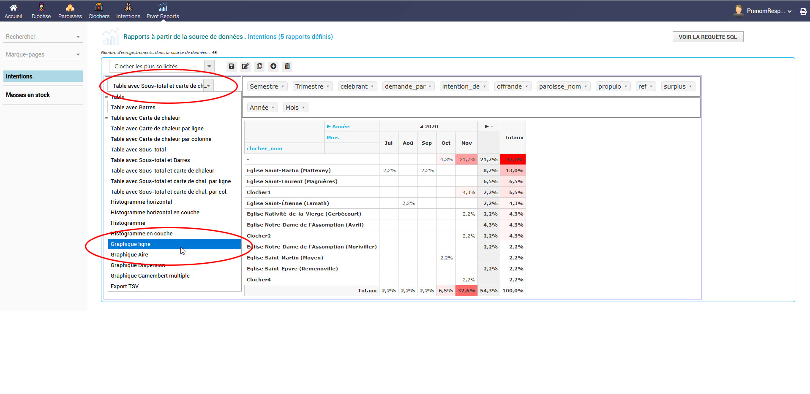
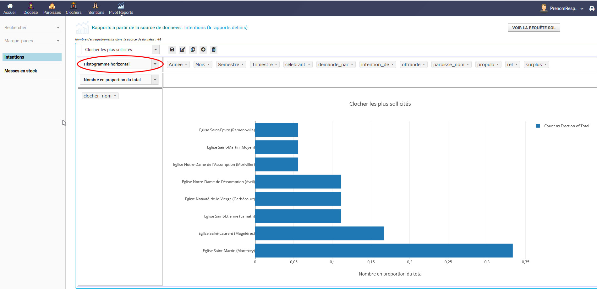
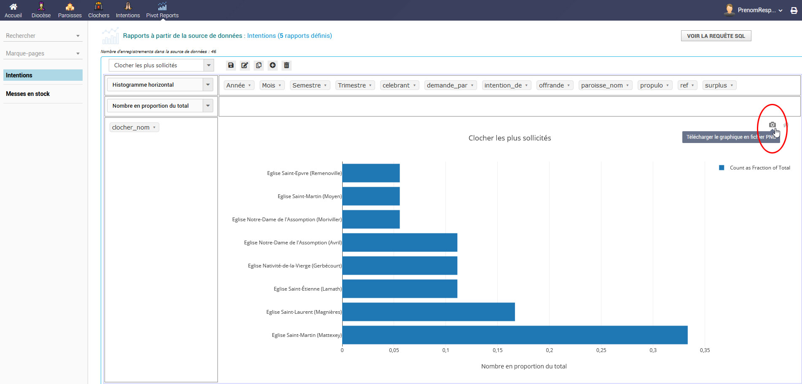
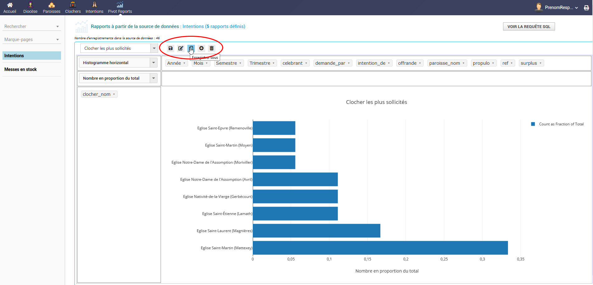

# Outil de statistiques croisées dynamiques - pivot report

## C'est quoi ?
* L'outil de statistiques croisées dynamiques que nous appellerons ensuite 'pivot report' est un outil statistique particulièrement puissant
* A partir des données disponibles en base, vous pouvez agencer les données en X et en Y pour obtenir des informations particulières
* Vous povuez également représenter ces données sous différentes formes : tableau, histogramme, tableau avec zone de chaleur
* Pivot report est un outil très puissant qui nécessite toutefois de vérifier les informations que l'on en tire...

## Comment l'utiliser ?
* Si vous avez la permission d'utiliser cet outil, un menu horizontal 'Pivot Reports' est affiché dans le menu horizontal
* Vous trouverez alors, dans le menu gauche des 'sources de données'
* Ces sources de données vont vous permettre de générer des rapports d'analyse
* Prenons par exemple, la source de données 'intentions'.
* Vous obtenez par défaut la liste des clochers les plus sollicités.
* Pour réaliser ce rapport nous avons simplement placé en ordonnées le champ 'clocher_nom' et demandé au rapport de travailler en 'nombre en proportion du total'
* Admettons que nous souhaitions avoir le détail par année, il nous suffit de cliquer/déplacer le champ "Année" en abscice.
* Si nous souhaitions avoir une lecture encore plus fine par mois, il suffirait de déplacer également le champ "Mois"
* Vous l'aurez compris, nous aurions pu tout aussi bien déplacer ces deux champs en ordonénes, le rapport aurait adapté aussitôt sa forme.

## Filtrer les données sur un rapport
* Dans le cas précédent, il est possible que vous ne souhaitiez pas consulter les informations pour tous les clochers
* Vous pouvez alors filtrer les données à afficher depuis le champ
* Essayer de cliquer sur la flèche située juste après 'clocher_nom'
* Une fenetre modale apparait dans laquelle vous pouvez sélectionner les clochers que vous souhaitez afficher

## Modifier la forme d'un rapport
* Vous pouvez à tout moment changer la forme du rapport que vous consulter pour le rendre plus explicite
* Pour cela, utiliser le menu déroulant 

## Exporter un rapport
* Vous pouvez exporter sous forme d'image les graphiques en cliquant sur l'icone appareil photo

## Enregistrer un rapport
* Lorsque vous êtes satisfait de la composition de votre rapport et si vous souhaitez pouvoir y accéder rapidement lors d'une prochaine visite
* Vous pouvez enregistrer un nouveau rapport en cliquant sur le bouton 'enregistrer sous' et représenté par une icone 
* D'autres options sont disponibles. Je vous laisse découvrir leur fonction en survolant les boutons avec votre souris
* Bien entendu, le rapport est dynamique et affichera les données disponibles 'en temps rééls'.

